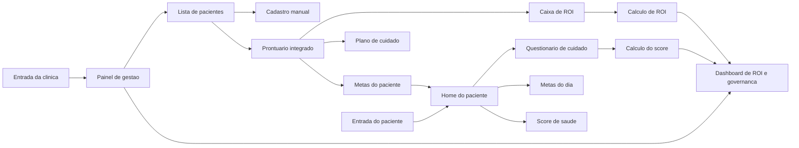
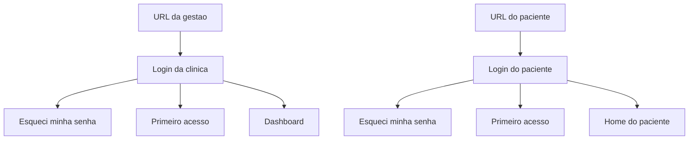
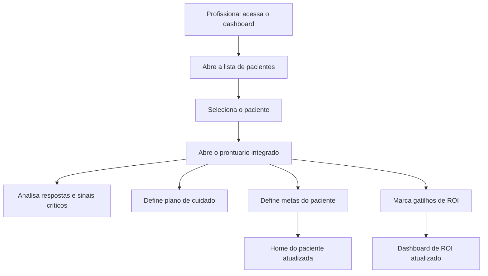
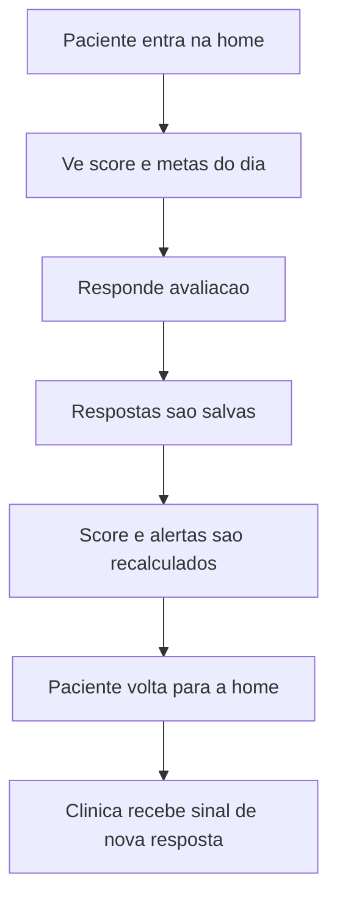

# CareOps VH - Diagrama do Sistema

Data: 2026-05-16

Este diagrama registra a estrutura do produto desde a entrada no sistema ate a base de implementacao do MVP funcional.

## 1. Visao macro

## 2. Fluxo de acesso

## 3. Fluxo de monitoramento clinico

## 4. Fluxo do paciente

## 5. Dominios do MVP

- Acesso e autenticacao
- Gestao da clinica
- Cadastro e monitoramento de pacientes
- Prontuario integrado
- Home do paciente
- Questionario de cuidado
- Score de saude
- Motor de ROI
- Alertas clinicos
- Auditoria e multitenancy

## 6. Base de implementacao

### Frontend

- `apps/web`
- rotas separadas por perfil
- interfaces desktop para gestao
- interfaces mobile-first para paciente

### Backend

- `apps/api`
- autenticacao
- dashboard
- pacientes
- proximos modulos:
  - prontuario
  - metas
  - questionario
  - ROI
  - logs

### Documentacao viva

- `03-consolidacao-decisoes-negocio.md`
- `04-fonte-de-verdade-mvp-funcional.md`
- `05-diagrama-sistema.md`
- `STATUS-ATUAL-2026-05-16.md`
